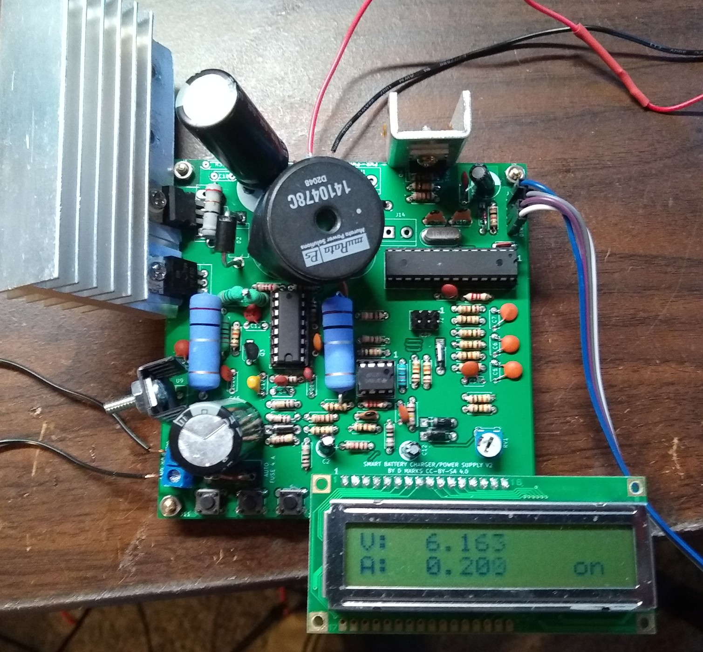

# FlexibleCharger

This is a battery charger based on a commonly-available ATMEGA328P for control and a common TL494 switching power supply IC.  It is intended to be easily and cheaply reproduced, and is for experimentation with different methods of charging batteries.  It is also useful as a power supply.

It is licensed under the Creative Commons CC-BY-SA 4.0, attribution and share-alike clauses.  It is open-source hardware and software created by Daniel Marks.  The schematic, gerber files, and Arduino code is available under open source licenses.

The device is intended to be powered from another unregulated or switching power supply, with up to 30 volts input.  As given in the schematic, the output can be up to 24 volts and 6 amps.  It would be possible to modify the circuit to perhaps allow for up to 28 volts and 15 amps.

It is designed to be used independently of a computer, having a simple user interface of three buttons and a 2-by-16 LCD alphanumeric display.  The software has been created in the Arduino environment to be easily modified and customized.  

WARNING:  Since this device gives you the ability to specify the voltage and/or current you wish to charge with, it is easily possible to damage or blow up batteries with improper configuration.  This is especially true of lithium batteries which can catch fire and be difficult to extinguish.  The author is not responsible for damage or injury resulting from the use of the device, as it is intended for experimentation.

The device must be calibrated before used, with the calibration parameters stored in EEPROM.  To do this, you need a voltmeter, a calibrated resistor with a known resistance from 5 to 10 ohms, and a wire to use as a short circuit load.  The procedure is:

* Choose the "Calibrate" menu options from the main menu.
* Remove any load from the output so that the output is open circuit.
* Press the button and the charger will apply a test voltage to the output terminals.
* Use a voltmeter to measure this voltage and enter it into the charger.
* Connect the calibrated resistor to output.
* Enter the resistance in ohms of the calibrated resistor.
* Press the button and the charger will apply a constant current to the charger terminals.
* Measure the voltage at the terminals of the calibrated resistor at the output.
* Press the button to end applying the current so that the resistor does not get too hot.
* Enter the measured voltage across the resistor terminals.
* Place the shorting wire across the output terminals.
* Press the button and the charger will apply a constant current to the charger terminals.
* After a few seconds, the charger shuts off the current and the calibration is complete.

To charge a battery, one must first enter a charging program.  At the time of this writing, there only two types of charging programs: Constant Voltage/Constant Current and Pulsed Recovery mode.  The "Change Program" is used to select the type of program and the parameters for the program.  There are 12 program banks currently.

* Constant Voltage/Constant Current:  Charge with a maximum constant current until a particular voltage is reached, then hold the voltage constant.  This may be used, for example, to float batteries.  The combination of constant voltage and constant current limits the power delivered to the battery.

* Pulsed Recovery Mode:  This is intended to be a mode that desulfates lead-acid cells.  It has multiple parameters.  Pulsed Voltage/Pulsed Current are the maximum voltage and current to apply during a pulse.  Pulse length is the duration of the current pulse to apply to the battery.  Interval is the time between pulses, which should be much longer than the pulse length so that significant heat does not build up in the battery.  Recovery volts is the voltage that the charger checks for when no current is applied to see if the battery has become sufficiently desulfated for normal charging.  Target volts and trickle charge is the maximum voltage and current to apply when charging after the recovery voltage has been achieved to trickle charge the battery to capacity.

"Execute Program" is used to start a charging program.  The charging programs generally may be aborted by pressing the rightmost button.

"Power supply" is a mode that may be used to use the charger like a constant voltage/constant current power supply.  The current limit is approximate and is intended to prevent short circuits from causing device damage.

Please take care when using this device, as it can potentially cause batteries to burn or explode.  Do not leave batteries unattended when charging.

